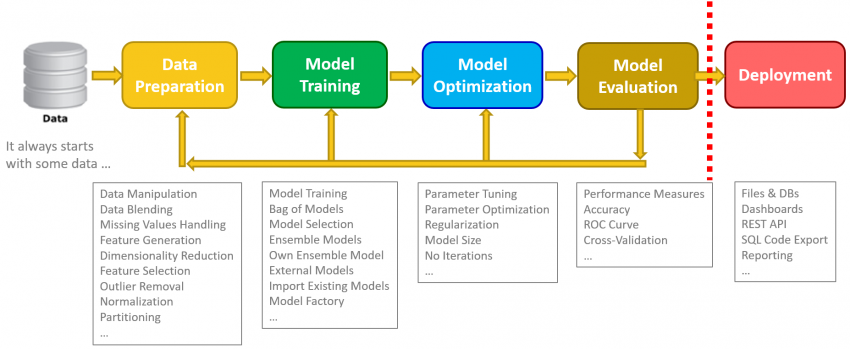
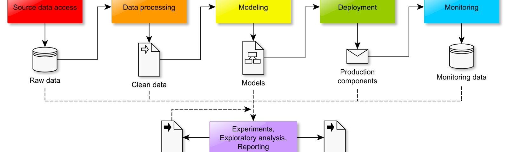

# DataScienceTools
Aim: A Collection of Useful Data Science and Machine Learning Tools,Libraries and Packages

# Data Science Tools List

### Based  On General Work Flow

#### Work Flow

#### Work Flow

### Fetching Data/Web Scrabing
- wget
- curl
- beautifulsoup
- mechanicalsoup
- request/urllib
- selenium (headless-browser framework for extracting javascript data)
- scrapy (OOP framework)
- newspaper3k: https://newspaper.readthedocs.io  # easily extract text from articles
- requests-html: requests-html: https://github.com/kennethreitz/requests-html
- sql/msql/sqlite
    
    
### Data Cleaning
- Pandas
- Dedupe: Remove duplicates
- Fuzzywuzzy: String Matching
- Scrubadab: Anonymize privacy
- Address Parsing/usaddress
- Dora : Working with missing/nulls
- PdfTables : Extracting Tables in PDF
- Tabulate
- Arrow : Dates,Timezone
- Pendulum : Dates
- Inflect/Num2Words : Convert numbers to text
- Imbalance Learn
- Flashtext
    
### Data Analysis
- Numpy
- Scipy
- Pandas
- Tabel
    
### Data Visualization
- Matplotlib
- Seaborn
- Plotly
- Bokeh
- Altair
- Dash: dashboard library from plotly
- Dataspyre: dashboard framework with flask backend
- folium
- geoplot
- D-Tale
- plotnine: clone of R's ggplot2
- joypy: https://github.com/sbebo/joypy/blob/master/Joyplot.ipynb
- bqplot
- jmpy
- pyqtgraph
- toyplot
- ipyleaflet: https://github.com/jupyter-widgets/ipyleaflet/
- probscale: easily make probability scaled axis: https://github.com/matplotlib/mpl-probscale
- adjustText: easily add non-overlapping annotated text (https://github.com/Phlya/adjustText/blob/master/docs/source/Examples.ipynb)
- make MATPLOTLIB animations with animatplot: https://animatplot.readthedocs.io/en/stable/

### Machine Learning/Deep Learning/Model Building
- Scikitlearn
- Keras
- Tensorflow
- Theano
- Pytorch
- sklearn-pandas
- imbalanced-learn
- hyperopt-sklearn: https://github.com/hyperopt/hyperopt-sklearn # Not pip installable yet
- tpot
- xgboost
- lightgbm
- fastText

### Natural Language Processing
- NLTK
- SpaCy
- TextBlob
- Stanford NLP
- AllenNLP
- Polyglot

### Computer Vision
- OpenCV
- Scikit Images/Scikit Video
- Pillow
    
### Workspace and Environment
+ Virtual Env
  - Anaconda
  - Pipenv
  - Venv

+ IDE
  - Jupyter lab/Jupyter Notebook
  - Nteract
  - VS code/Sublime Text/Juno Atom/ etc
  - Pycharm,etc

+ Cloud
  - Colab
    
    
### Serializers
- Joblib
- Pickle
- Ray
- Csvkit
+ Json
    
### Speed and Large Dataset
- Pandas Modin
- Dask
- Pyarrow
- Fastparquet
- vaex: https://github.com/maartenbreddels/vaex
- Pandas on Ray: https://github.com/modin-project/modin
- dampr: https://github.com/Refefer/Dampr
- Cloud Computing Services (GCP,Bigquery,AWS,Azure)
    
### Forecasting
- pyramid-arima https://github.com/tgsmith61591/pyramid
- fbprophet: time series forecasting (additive model) which performs best with high frequency data
- pyflux: time series library: https://github.com/RJT1990/pyflux

### PyData stack
   - numpy
   - scipy
   - pandas
   - jupyter
   - statsmodels

### Profiling
   - pandas-profiling: https://github.com/pandas-profiling/pandas-profiling
   - dataprofiler: https://github.com/capitalone/DataProfiler
   - memory_profiler: https://github.com/pythonprofilers/memory_profiler
   - py-spy: https://github.com/benfred/py-spy/blob/master/README.md
   - pyflame: https://github.com/uber/pyflame   # Does not support Windows
   - pyinstrument
   - scalene
   - cprofile
   

### Forecasting
   - pyramid-arima https://github.com/tgsmith61591/pyramid
   - fbprophet: time series forecasting (additive model) which performs best with high frequency data
   - pyflux: time series library: https://github.com/RJT1990/pyflux

### Niche stats libraries
   - lifelines: survival analysis: https://github.com/CamDavidsonPilon/lifelines
   - convoys: https://better.engineering/convoys/

### Jupyter Notebook Related
   - ipysheet: https://github.com/QuantStack/ipysheet
   - ipypivot: https://github.com/PierreMarion23/ipypivot
   - ipytree: https://github.com/QuantStack/ipytree
   - papermill- scrapbook: https://github.com/nteract/papermill (parameterized notebooks)
   - nteract-scapbook: https://github.com/nteract/scrapbook
   - how to pass a dataframe between notebooks: https://github.com/nteract/papermill/issues/215
   - but instead, you should really save the dataframe somewhere and then just pass the path of the saved dataframe
   - jupytext: edit notebooks as text files!  https://github.com/mwouts/jupytext

### Database related
   - pyodbc
   - turbodbc
   - ipython-sql
   - db.py (dead project?)
   - sqlalchemy
   - sqlalchemy-turbodbc
   - postgresql
   - sqlmodel

### ETL or data engineering related sorted from lightest to heaviest framework
   - papermill- scrapbook: https://github.com/nteract/papermill (parameterized notebooks)
   - nteract-scapbook: https://github.com/nteract/scrapbook (for passing data between notebooks)
   - dequindre: https://github.com/vogt4nick/dequindre
   - petl: https://github.com/petl-developers/petl
   - bonobo
   - pypeln: https://github.com/cgarciae/pypeln/
   - botflow: https://github.com/kkyon/botflow
   - https://github.com/mara/data-integration
   - dbt: https://www.getdbt.com/
   - Spotify Luigi - (works with Windows)
   - Apache Airflow - Windows not supported (it is a PITA to try to install on Windows)
   - prefect: https://docs.prefect.io

### Data validation and cleaning frameworks
   - https://github.com/pyeve/cerberus
   - https://github.com/great-expectations/great_expectations
   - https://github.com/cosmicBboy/pandera
   - https://pyjanitor.readthedocs.io/
   - https://github.com/keleshev/schema
   - https://github.com/TMiguelT/PandasSchema
   - https://github.com/TomAugspurger/engarde

### R related
   - rpy2
   - plydata (dplyr clone)
   - plotnine (ggplot2 clone)

### Machine Learning Related - mostly for tabular data or non-NN
   - scikit-learn
   - sklearn-pandas
   - imbalanced-learn
   - hyperopt-sklearn: https://github.com/hyperopt/hyperopt-sklearn # Not pip installable yet
   - tpot
   - xgboost
   - lightgbm
   - fastText
https://github.com/kvh/recurrent  - extract datetimes from English sentence

### Webscraping
   - beautifulsoup4
   - mechanicalsoup
   - selenium (headless-browser framework for extracting javascript data)
   - scrapy (OOP framework)
   - newspaper3k: https://newspaper.readthedocs.io  # easily extract text from articles
   - requests-html: requests-html: https://github.com/kennethreitz/requests-html

### Data Web Apps and ML Web Apps
   - Streamlit : https://github.com/streamlit
   - Gradio : https://github.com/gradio-app/gradio
   - Mercury Mljar: https://github.com/mljar/mercury
   - Panel : https://github.com/holoviz/panel
   - Dash 
   - Databutton
   - Flask
   - Django
   - FastAPI

### Utilities
   - https://github.com/tldr-pages/tldr-python-client # replacement for man pages
   - bropages (http://bropages.org/): sudo apt-get install ruby-dev, sudo gem install bropages
   - https://github.com/gleitz/howdoi
   - inspect https://docs.python.org/3/library/inspect.html
   - prettypandas
   - https://github.com/seatgeek/fuzzywuzzy
   - https://github.com/RobinL/fuzzymatcher
   - pytest
   - requests
   - requests-html: https://github.com/kennethreitz/requests-html
   - psutil
   - pdir2: https://github.com/laike9m/pdir2
   - helping: https://github.com/ConquerProgramming1/helping

### Amazon Web Services
   - PyAthena - use plain 'ol SQL: https://github.com/laughingman7743/PyAthena

### CLI
   - click - for making CLI
   - fire - for making CLI
https://github.com/tmbo/questionary

### Progress Bars
   - tqdm: https://github.com/tqdm/tqdm
   - fastprogress: https://github.com/fastai/fastprogress

### Misc.
   - Sending Windows 10 notifications: https://github.com/jithurjacob/Windows-10-Toast-Notifications
   - Another Windows notification library: https://github.com/malja/zroya
   - glances: CPU/memory monitoring
   - pendulum: a better datetime library, better than arrow
   - visidata: https://jsvine.github.io/intro-to-visidata/index.html
   - schedule: job scheduling for humans:https://github.com/dbader/schedule
   - pyautogui
   - ptpython: better REPL
   - xlwings: Excel VBA, but with Python instead
   - openpyxl: https://openpyxl.readthedocs.io/en/stable/
   - https://github.com/SimonBiggs/scriptedforms
   - black: source code formatter

### debugging
   - ipdb
   - pudb: https://github.com/inducer/pudb - Windows not supported, need cygwin

### logging
   - https://github.com/Delgan/loguru

## Languages ,Tools, ETC
### Languages
- R 
- Python 
- Julia
- Scala,Matlab,Octave
- C,C++,C#
- Perl,Ruby
- Javascript(Tensorflow.js/Web apps)
- Java
- Clojure
- Fortran

### Tools
- SQL  
- Hadoop 
- SAS 
- Java 
- Hive 
- Pig 
- SPSS 
- Perl 
- Tableau 
- E
- NoSQL 
- AWS 
- C 
- HBase 
- Bash 
- Spark 
- ElasticSearch 
- PHP 
- Scala 
- Shark 
- awk
- Cascading
- Cassandra
- JavaScript
- JMP
- Mahout
- objective-C
- QlickView
- Redis
- Redshift
- sed

##### By
- Jesse E.Agbe (JCharis)
- Jesus Saves @JCharisTech
- J-Secur1ty

##### Inspired By 
+ Others
